## AssetGuardian

## Table of Contents
* [General Information](#general-information)
* [Technologies Used](#technologies-used)
* [Features](#features)
* [Screenshots](#screenshots)
* [Dependencies](#dependencies)
* [Setup on Windows OS](#setup-on-windows-os)
* [Room for Improvement](#room-for-improvement)
* [Cooperators](#cooperators)


### General Information
AssetGuardian is a Django-powered application designed for exploration and management of IT assets.

Crafted by a trio of Python developers in just 42 hours, the project embraces the MVP (Minimum Viable Product) approach, enabling rapid development and iteration. Tasks included brainstorming business ideas, architectural design, logical implementation, and integrating front-end elements.

Practicing application development in a team setting, with a well-defined task allocation, the team brought the envisioned concepts to fruition, culminating in the creation of this application.

By adopting the MVP strategy, the team prioritized the development of critical features essential for delivering value to users.

### Technologies Used
- [Python](https://www.python.org/)
- [JavaScript](https://developer.mozilla.org/)
- [Django](https://www.djangoproject.com/)
- [SQLite](https://www.sqlite.org/)
- [HTML](https://en.wikipedia.org/wiki/HTML)
- [CSS](https://en.wikipedia.org/wiki/CSS)
- [Bootstrap](https://getbootstrap.com/)
- [PyTest](https://pypi.org/project/pytest/)

### Features
- **Centralized Asset Management:** AssetGuardian serves as a centralized platform for managing all types of assets. Users can easily view, add, update and delete assets through the application.
- **Asset Information Storage:** The application stores comprehensive information about each asset, including its category, description, vendor, serial number, value, assigned employee and purchase date. This information allows users to track and monitor assets effectively.
- **Employee Management:** In addition to assets, AssetGuardian enables the management of employees. Users can add, update and delete employee records within the application.


#### User
- **User Authentication:** Users can register, login and logout. The unique username is required for registration.
- **Asset Exploration:** Logged-in users can view, filter and sort assets.
- **Asset Management:** Logged-in users with appropriate permissions can add, update and remove assets.

#### Admin
- **Admin Dashboard:** After logging in, the admin is directed to a dashboard where comprehensive information is displayed, allowing efficient management of assets and employees.

### Screenshots

### Main page
The Asset List page provides a comprehensive view of all assets within the application.
Users can explore the list of assets and perform actions such as deletion and updating.
The "Delete" and "Update" buttons redirect users to the appropriate URL addresses for these actions.
Additionally, functionality is implemented to highlight a line when the mouse hovers over it.
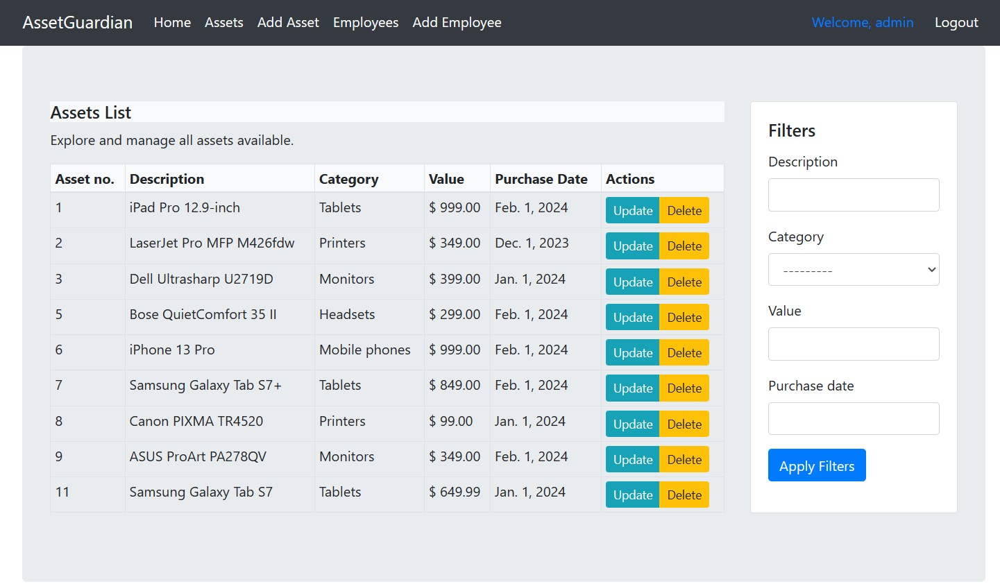


The application provides functionality to filter assets and reset applied filters.
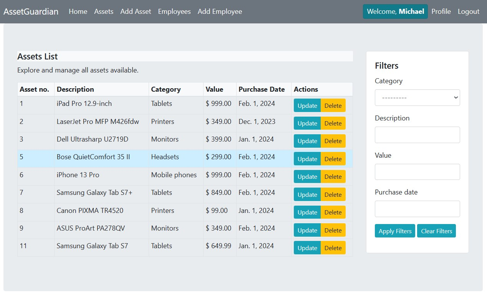

The Employees List page provides a comprehensive view of all employees within the application.
Users can explore the list of employees to view their details.
This page serves as a hub for managing employee information.
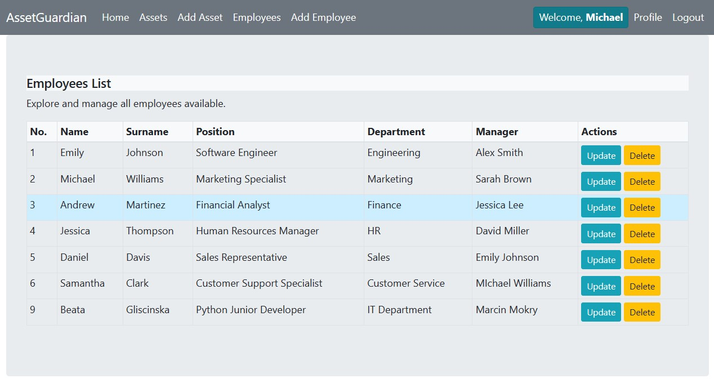

If a user lacking necessary permissions attempts to update or delete assets, they will be redirected to another page displaying a relevant message.
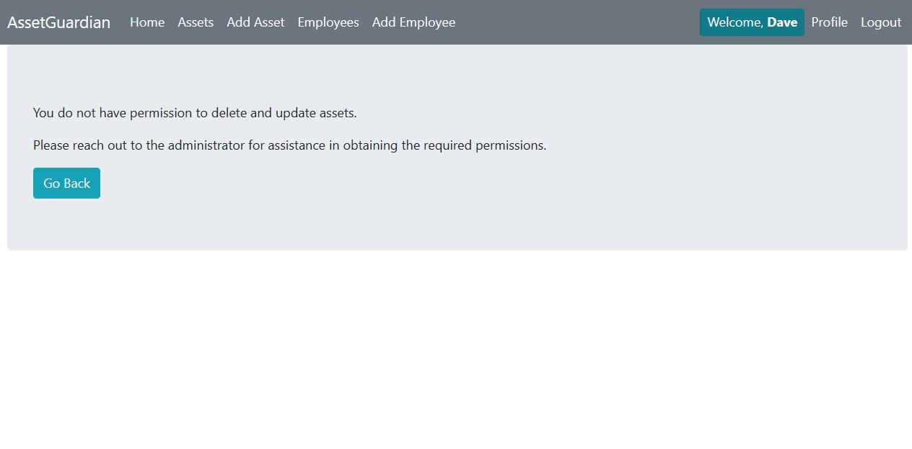

The "Add Asset" and "Add Employee" forms allow users with required permissions to add new assets and employees to the system.
These forms provide fields for entering relevant information about the asset or employee being added.
Upon submission, the data entered into these forms is processed and stored in the system's database.

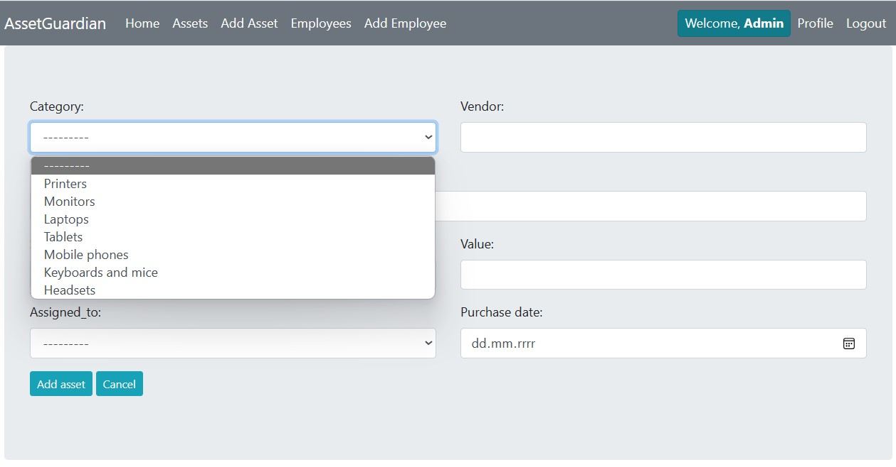
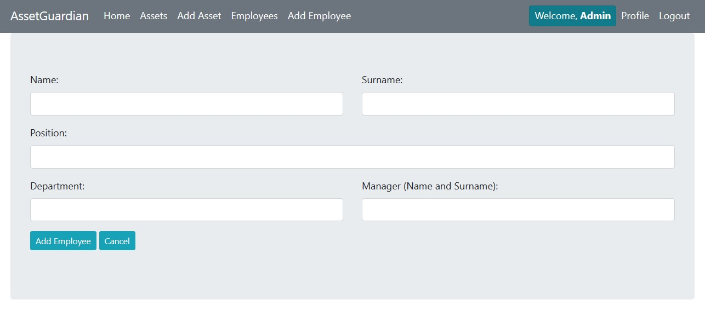
Applications implement a custom validation in Add asset form to ensure that each serial number is unique. Raises a validation error if a duplicate serial number is found.
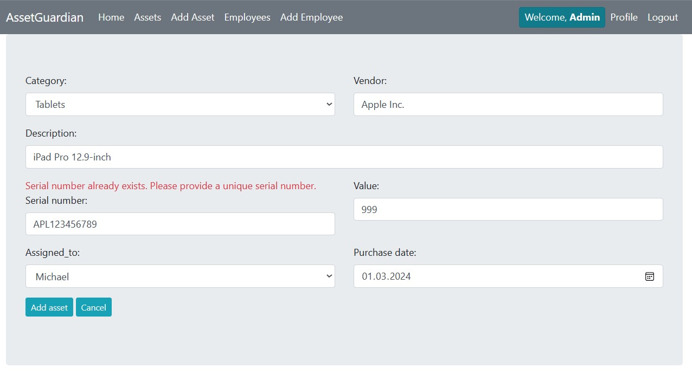
We achived this thanks to, clean_serial_number, ensures that the entered serial number in a Django form is unique among existing records in the database, raising a validation error if it already exists.To achieve this, it executes a database query excluding the currently edited object, ensuring accurate uniqueness validation.
```bash
    def clean_serial_number(self):
        serial_number = self.cleaned_data['serial_number']
        asset_exists = Asset.objects.exclude(id=self.instance.id).filter(serial_number=serial_number).exists()
        if asset_exists:
            raise forms.ValidationError("Serial number already exists. Please provide a unique serial number.")
        return serial_number

````
The application includes login and sign-up functionality.
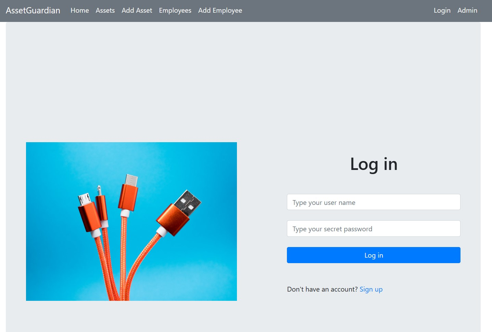
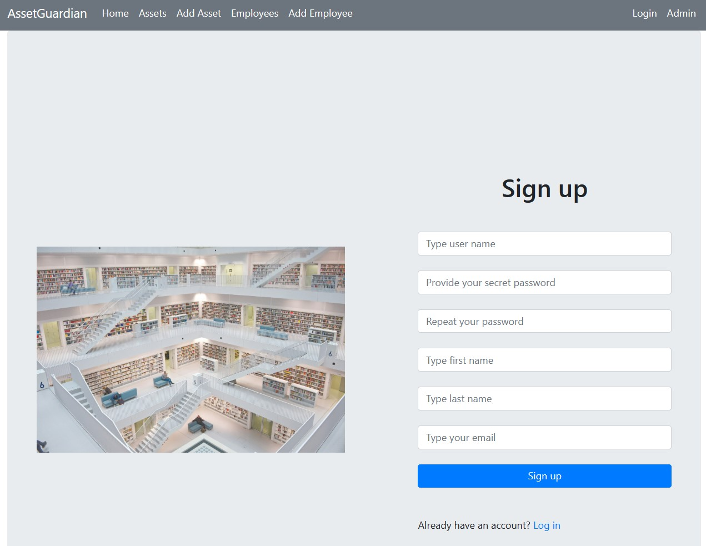

The profile page provides functionality for reviewing and updating user information.
Users can review their profile data and update it as necessary.
Additionally, users can change their password from this page.
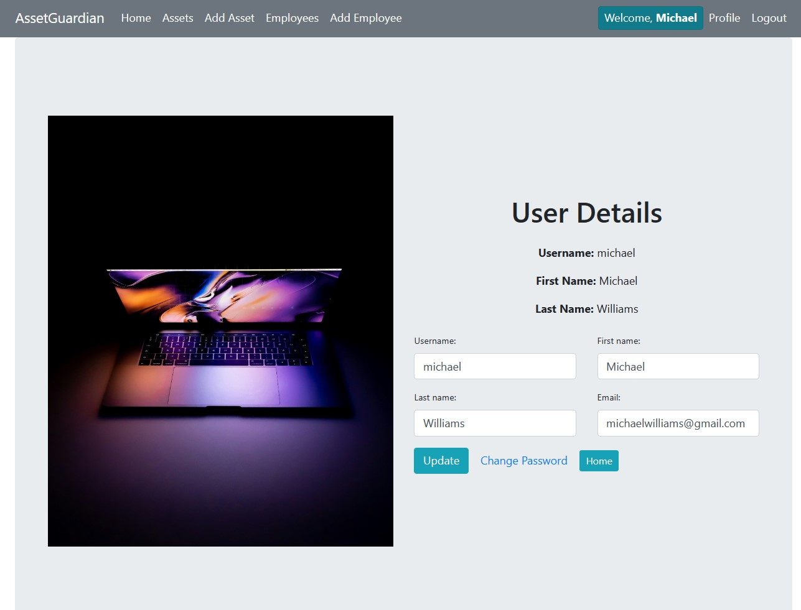
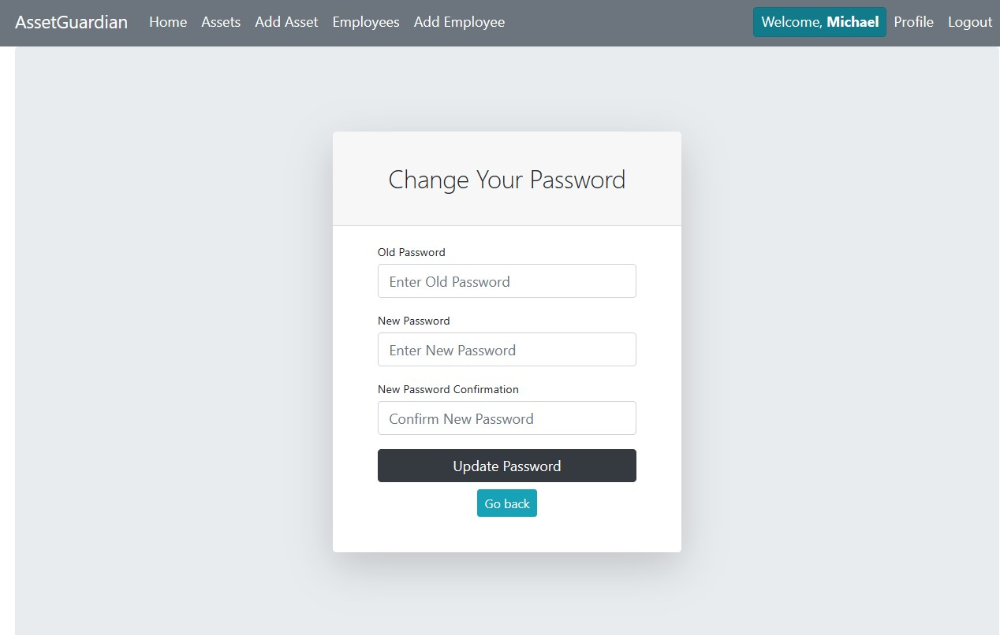


### Dependencies

* Django: Django is a popular Python framework used for building web applications quickly and efficiently. It comes with a variety of built-in features that simplify the development process.

* crispy-bootstrap4: Crispy-Bootstrap4 is an extension for Django Crispy Forms that helps in styling forms with Bootstrap 4, making them look more visually appealing and responsive.

* django-crispy-forms: Django Crispy Forms is a Django application that provides a clean and customizable way to manage form layouts and appearance in web applications.

* django_filter: Django Filter is a tool used to simplify the implementation of dynamic query filters in Django projects, particularly useful for searching and filtering large datasets efficiently.


### Setup on Windows OS
To clone this repository, refer to [this publication](https://docs.github.com/en/repositories/creating-and-managing-repositories/cloning-a-repository).

To download and install Python 3.12.2, visit [this link](https://www.python.org/).

Python version check:
```bash
python --version
```

Create and activate a virtual environment:

```bash
venv\Scripts\activate
```

Install dependencies:

```bash
pip install -r requirements.txt
```
Set up the database:

```bash
python manage.py migrate

```
Create a superuser:

```bash
python manage.py createsuperuser
```

Run the server:

```bash
python manage.py runserver
```

Run the application:

```bash
# Access from browser or using curl
curl 127.0.0.1:8000/


```

### Room for Improvement

To be improved:
- make constrains for username and password,
- add possibility to reset password with link to e-mail,
- add dropdown list to choose manager from employees' list,


### Cooperators

This updated README.md file provides clear and concise information about the AssetGuardian application, its features, technologies used, setup process and testing procedures. It improves readability for better user understanding.
